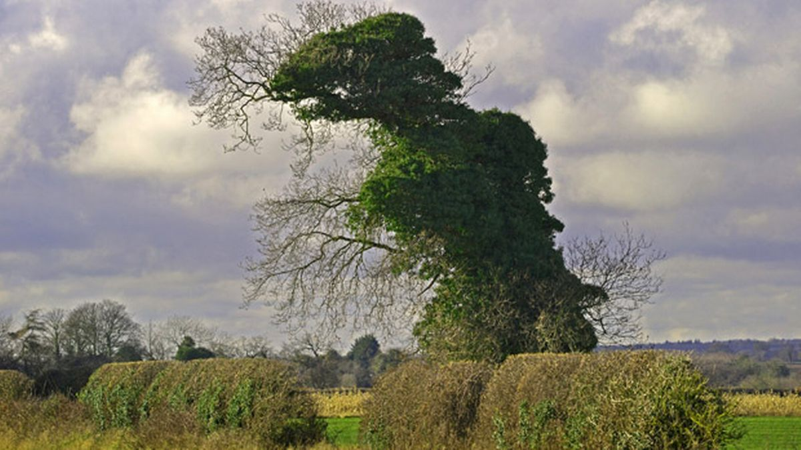
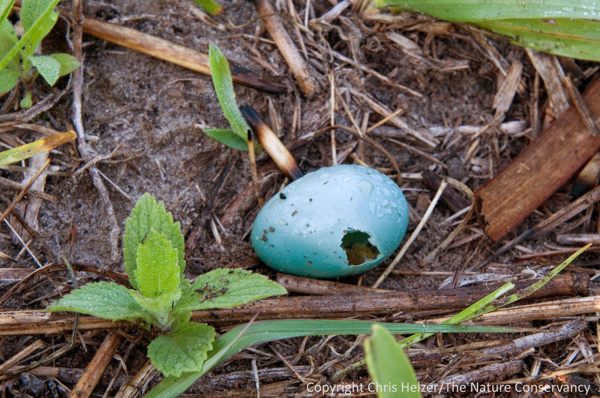
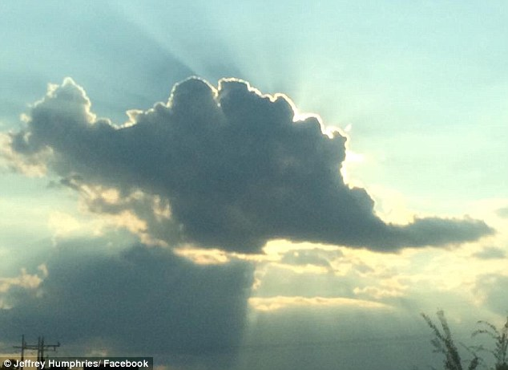
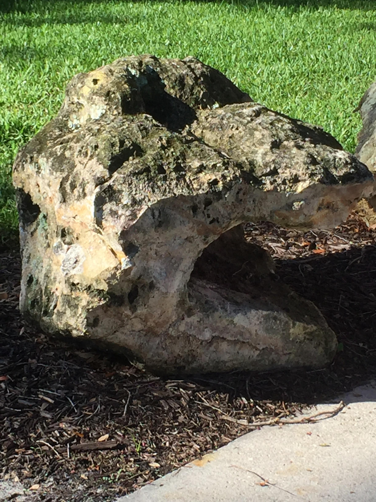

---
# set the layout to use, in this case, the homepage one
layout: layouts/homepage

# set the page title
title: Dinosaur Park

# We can set extra info here to use in our templates

hero:
    title: "Number 1 dinosaur sighting location"    

content.title: "This week's sightings"

---

## Welcome to the park

Dinosaur Park is the largest and only specialised dinosaur sighting park in the southern hemisphere. Check this page to see the latest dinosaur sightings in the park. 

# This week's sightings

#### Monday 2 May 2022 Taken by park photographer Tim Allen

Tree or dinosaur? Dinosaur, we say! This dinosaur hangs around the park most of the year and appears to turn into a skeleton during Autumn. 

#### Sunday 1 May 2022 Taken by park photographer Tim Allen

Here come the sceptics. "That could be any animal's egg". Guess what, dinosaurs are a part of any animals. We conducted a test to determine the species of this egg. We heated it in water to a boiling point for several minutes, peeled the egg and our dinosaur expert tasted it. Dinosaur. 

#### Sunday 1 May 2022 Taken by park photographer Tim Allen

Wingless dinosaur spotted flying over the park! 

#### Sunday 1 May 2022 Taken by park photographer Tim Allen

First sighting of the day! Park photographer came across this very still dinosaur for the 4th time this year!